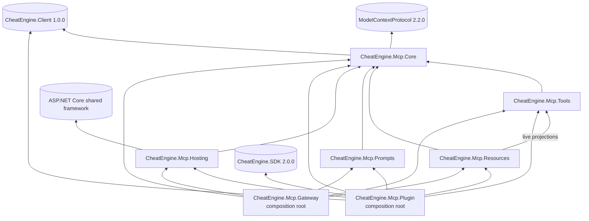
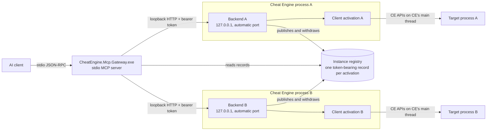
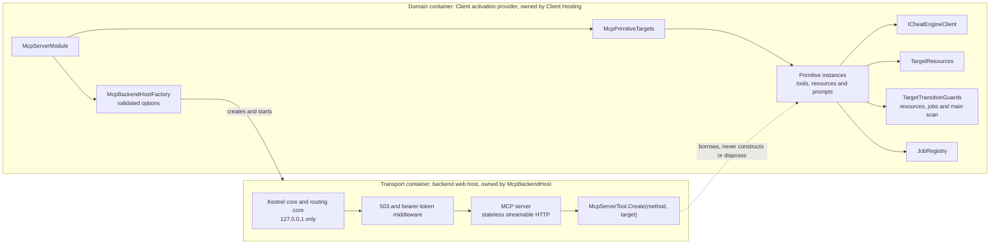
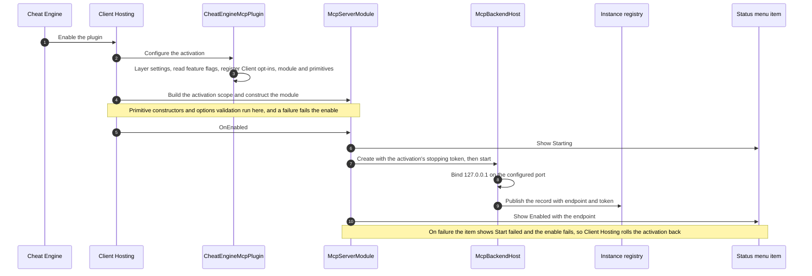
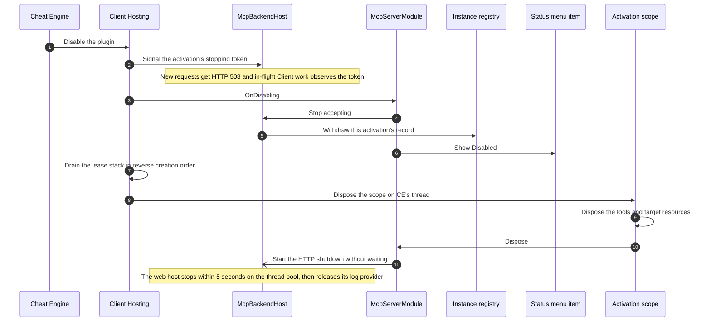
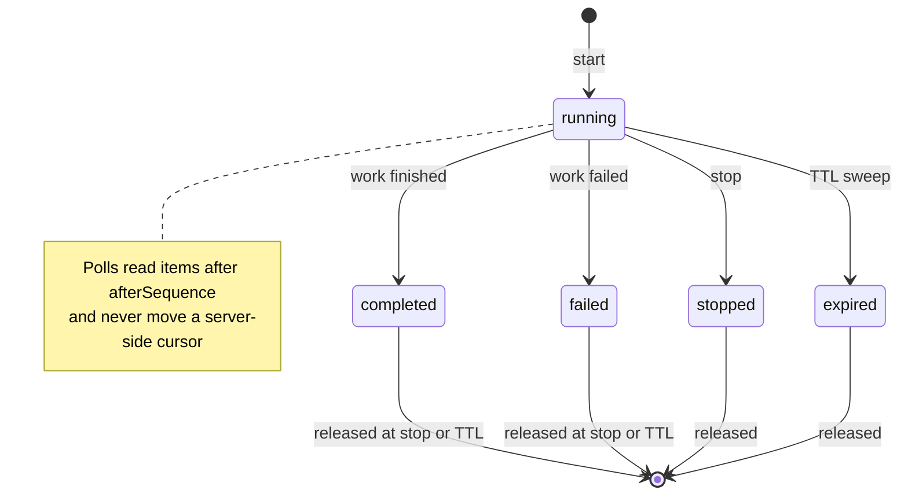
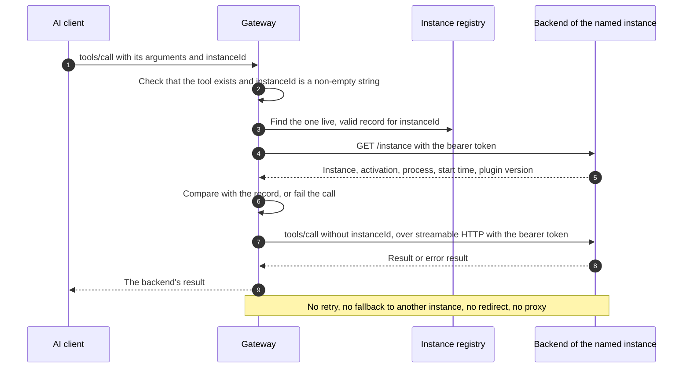

# Architecture

This page explains how CheatEngine.Mcp is built, what runs where, and why.
It is written for contributors and for operators who want to understand the moving parts.
To install it, start with [Getting started](getting-started.md).
Settings are described in [Configuration](configuration.md), client registration in [Clients](clients.md), and every tool in the [tool reference](reference/tools.md).

> **Status.** This page describes the 2.0.0 (v2) architecture.
> The current branch already contains the v2 foundations: the project layout, the composition builders, the error contract and request filters, the contract rules, the value helpers, the Lua job kernel, the plugin's own logger, the minimal plugin folder and Native AOT analysis of every product project.
> Anything marked **(v2, in progress)** is an adopted design that the code does not implement yet.
> `CheatEngineToolNames` freezes the v2 inventory, and the composed catalogue registers all 172 backend tools with no historic aliases.
> The running `tools/list` schema remains the authority for effective names and arguments.

## Purpose

CheatEngine.Mcp lets an AI client drive one or more Cheat Engine 7.7 x64 processes through the Model Context Protocol (MCP).
Each Cheat Engine (CE) process loads the plugin, which hosts its own authenticated MCP backend on loopback HTTP.
One stdio gateway, launched by the AI client, discovers those backends and routes every call to the instance named by its `instanceId`.

The design follows a few goals:

- CE's main thread is never blocked by transport work or open-ended waits.
- Each CE activation owns its state, nothing is shared between instances, and an instance ID never changes during an activation.
- The gateway and every backend advertise one catalog, produced by one composition.
- Failures are reported honestly: a partial or unknown effect is never a success.
- Every CE capability is exposed deliberately, with bounded results and explicit configuration switches.

## Projects and dependencies

| Project | Path | Role |
|---|---|---|
| CheatEngine.Mcp.Core | `libs/CheatEngine.Mcp.Core` | The shared domain library and the only project that references the `CheatEngine.Client` package: composition builders, primitive manifest and catalog, contract rules, error contract, value formats, Client dispatch, target leases, the fixed-Lua runtime and the Lua job kernel. |
| CheatEngine.Mcp.Tools | `srcs/CheatEngine.Mcp.Tools` | The MCP tools and their single entry point `AddTools()`. |
| CheatEngine.Mcp.Resources | `srcs/CheatEngine.Mcp.Resources` | Static MCP knowledge resources and workflow bodies through `AddResources()`, with instance-scoped projections added by their read-only tool domains. |
| CheatEngine.Mcp.Prompts | `srcs/CheatEngine.Mcp.Prompts` | The 22 static workflow prompts through `AddPrompts()`. |
| CheatEngine.Mcp.Hosting | `srcs/CheatEngine.Mcp.Hosting` | The per-activation loopback backend, its options, instance discovery and the stdio gateway router. |
| CheatEngine.Mcp.Plugin | `srcs/CheatEngine.Mcp.Plugin` | The CE plugin `CheatEngine.Mcp.Plugin.dll`: composition root, lifecycle module, status indicator, logger, feature options and the shipped `appsettings.json`. |
| CheatEngine.Mcp.Gateway | `srcs/CheatEngine.Mcp.Gateway` | The gateway executable's composition root. |

An arrow points from a project to the project or package it references.



- Core is referenced by Tools, Resources, Prompts and Hosting; only the Plugin and the Gateway compose.
- Hosting never references Tools, Resources, Prompts, the Client or a logging library: it sees primitives only through the Core manifest and borrows their instances.
- Resources reference Tools to project read-only tool results as live resources; Hosting still references neither.
- Only the plugin project sets `CheatEngineClientPluginProject` and references `CheatEngine.SDK` directly, which the build guards CEMCP002 and CEMCP003 enforce.
- CEMCP001 fails the build when the plugin would ship an app-local copy of a shared-framework assembly, and CEMCP004 when a dependency asset would land in a subfolder that the Client deployment drops.
- CEMCP005 keeps every product project under `libs/` and `srcs/` analyzed for Native AOT and trimming, and CEMCP006 keeps the plugin a framework-dependent folder.
- `InternalsVisibleTo` targets only the test project.
- [`ArchitectureTests`](../tests/CheatEngine.Mcp.Tests/Architecture/ArchitectureTests.cs) enforces the reference graph, the absence of mutable static state and the composition rules.

## Runtime topology



- The AI client starts the gateway as a stdio MCP server; the gateway opens no network listener.
- Each enabled plugin starts one backend on `127.0.0.1`, on a free port by default, and publishes a discovery record with its endpoint and bearer token.
- The gateway reads the records, verifies each backend's identity and forwards each call to the instance its `instanceId` names.
- A backend belongs to exactly one Client activation, which owns that CE process's target state.
- The backend runs the MCP streamable HTTP transport in stateless mode: no MCP session lives in the backend, only the activation's services hold state.
- Two instances may attach to the same target process; both can then change it.

### Discovery records and instance identity

Each activation writes one record to `%LOCALAPPDATA%\CheatEngine.Mcp\instances\<activation ID>.json`.
The plugins and the gateway must use the same directory; see [Configuration](configuration.md) for the overrides.

| Field | Meaning |
|---|---|
| `instanceId` | `ce-<CE process ID>-<activation GUID>`; new on every enable. |
| `name` | Display name, at most 128 characters; names may repeat. |
| `activationId` | The activation GUID, also the file name. |
| `processId`, `processStartUtcTicks` | The CE process and its start time. |
| `endpoint` | `http://127.0.0.1:<port>/`. |
| `accessToken` | 64 hexadecimal characters, generated per activation. |
| `pluginVersion` | The loaded plugin's version. |

- The plugin writes the record atomically (a temporary file, then a move) once the listener runs, and deletes it when disabling starts.
- The gateway reads a record only if it is at most 16 KiB, well formed, named after its activation ID, points at a literal loopback endpoint, carries a 64-character hexadecimal token, and its CE process is alive with the recorded start time.
- A record is only a candidate: before listing an instance and before every routed call, the gateway calls `GET /instance` with the bearer token and requires the same instance ID, activation, process ID, start time and plugin version.
- `instance_list` probes candidates 16 at a time within a 10-second budget and reports `discoveryIncomplete: true` when the budget ran out.
- It returns the instance ID, display name, CE process ID and plugin version, never an endpoint or a token.
- Disabling and re-enabling the plugin, or restarting CE, creates a new instance ID; calls with an old ID fail.

## Two containers per activation

Each activation uses two dependency-injection containers with different owners.



The **domain container** is the Client activation provider.
Client Hosting builds one scope per activation, and the tools, `TargetResources`, `TargetTransitionGuards` and `JobRegistry` are scoped to it.
When Client Hosting constructs `McpServerModule`, `McpPrimitiveTargets` resolves every declared primitive instance and the backend factory validates its options, so a constructor or options failure fails the enable before any listener starts.
Tool constructors must not dispatch Client work.

The **transport container** is the backend's web application.
`McpBackendHost` builds it from `WebApplication.CreateEmptyBuilder` in the `Production` environment, with Kestrel core, routing core and a no-op host lifetime.
CE's ambient `appsettings.json`, the `ASPNETCORE_*`, `DOTNET_*` and `Kestrel__*` variables and hosting startup assemblies never apply, and `app.Urls.Add` is the only address source.
It binds the borrowed instances with the instance overloads of `McpServerTool.Create` and its resource and prompt equivalents.
It registers no Client service, façade or primitive type, so HTTP can never create another Client activation or dispose a tool.
Request bodies are limited to 8 MiB.

The activation scope owns the primitive instances and disposes them on CE's thread, after the Client has drained the activation's leases.

## Lifecycle

### Enable



- Settings are layered once per enable: option defaults, the plugin folder's `appsettings.json`, the user's `appsettings.json`, then the `MCP_*` variables; there is no reload.
- CheatEngine.Client 1.0 has no UI API, and CheatEngine.SDK 2.0.0 admits Client dispatch only after the enable callback returns and closes it before the disable callbacks.
- The status item therefore uses the one narrow SDK exception, `LuaToolRuntime.ShowPluginStatus`: a fixed, main-thread-only script that only `McpStatusIndicator` calls.
- The item's click handler is pure Lua, and its passive `Disabled` state survives until CE closes.

### Disable



- Never synchronously join HTTP workers on CE's main thread.
- No Client call works inside the enable or disable callbacks, so `OnDisabling` only closes admission, withdraws discovery and updates the status item.
- CE-owned state survives a disable: the address list and its freezes, structures, comments, breakpoints, speedhack, pause and the visible scan tab.
- Disabling the plugin is therefore not cleanup; the tools that created state have explicit delete, release, stop or restore operations.

## Composition

The plugin and the gateway compose the same primitives through C# 14 extension-block builders.

```csharp
// CheatEngine.Mcp.Plugin, CheatEngineMcpPlugin.Configure: one activation, Backend mode.
builder.AddCheatEngineMcp(McpPluginEnvironment.Current, log)
    .AddTools()
    .AddResources()
    .AddPrompts();

// CheatEngine.Mcp.Gateway, GatewayProgram.CreateBuilder: a schema-only catalog, Catalog mode.
builder.AddCheatEngineMcpGateway(args, version)
    .AddTools()
    .AddResources()
    .AddPrompts();
```

- Each primitive project owns one entry point on `ICheatEngineMcpBuilder`: `AddTools()`, `AddResources()` or `AddPrompts()`.
- Inside it, primitives are declared only with `AddToolType<T>()`, `AddResourceType<T>()` and `AddPromptType<T>()`, and source-generated JSON metadata with `AddJsonTypeInfoResolver(...)`.
- Never use `WithTools<T>`, the SDK's `*FromAssembly` scanners or `ActivatorUtilities`.
- The declarations build one ordered manifest, `CheatEngineMcpPrimitiveOptions`.
- In `Backend` mode each declared type is also registered as an activation-scoped service, and `WithCheatEnginePrimitives(manifest, McpPrimitiveBinding.FromTargets(targets))` binds each marked method to its borrowed instance.
- In `Catalog` mode (the gateway and schema tests) only the manifest is recorded; `McpPrimitiveCatalog.Create` builds detached protocol metadata in a throwaway container whose instance targets refuse invocation, so no primitive type is ever constructed.
- Both modes use the same serializer options (`CheatEngineMcpJson.CreateOptions`) and the same schema transform (`SchemaTransform` collapses nullable type arrays and drops numeric keywords outside the signed 64-bit range, which strict clients reject).
- The gateway and every backend therefore advertise identical schemas; composition parity tests and golden snapshots in `tests/CheatEngine.Mcp.Tests/Contract` check it.
- Startup validation (`McpPrimitiveValidator`) fails on duplicate tool names, prompt names or resource URI templates instead of dropping them, and applies the contract rules below.

## Tool contract (v2)

### Names and metadata

`McpContractRules` checks these rules at startup for every tool that publishes an output schema:

- The name matches `^[a-z][a-z0-9]*(_[a-z0-9]+)+$` within 40 characters, in the shape `<domain>_<verb>[_<object>]`.
- The domain comes from a reviewed list (runtime, process, memory, scan, aob, pointer, module, symbol, speedhack, util, code, asm, record, table, structure, debugger, exec, dotnet, mono, kernel, lua, and `instance` for the gateway's own tool), and the verb from a closed, reviewed list.
- The title is unique, in sentence case, and at most 60 characters; the description is at most 1,024 characters; every parameter has a description and a non-empty schema.
- All four annotations are set explicitly: `readOnlyHint`, `destructiveHint`, `idempotentHint` and `openWorldHint`; a tool is never both read-only and destructive; a poll is read-only and idempotent; a stop or release is idempotent.
- The output schema has type `object`, and no tool declares `instanceId`, which only the gateway adds.

Every tool has an output schema and receives the duplicate and `instanceId` checks.
`CheatEngineToolNames` and the reviewed `open-world-tools.txt` and `tool-summary.txt` catalog artifacts record the public contract.

### Results

- Each v2 tool returns an object-shaped `sealed record` with `UseStructuredContent=true`; its output schema is derived from the return type, the same JSON is also sent as text, and there is no `success` field.
- Value formats come from `Core/Values`.
- Addresses are uppercase hexadecimal without `0x`; 64-bit integers and memory values are decimal strings; counts, sizes and indexes are numbers; bytes are spaced uppercase hexadecimal such as `"48 8B 05"`; pointer offsets are signed hexadecimal in dereference order.
- Paging takes `limit` and `offset` and returns `nextOffset`, omitted when the list is complete, and `truncated`, reserved for host-side caps.
- Contract enums are `snake_case` through `ContractEnumConverter<T>` and reject integers; a Client or SDK enum never appears in a signature.

### Errors

A tool reports a failure by throwing `CheatEngineToolException`; Client failures are mapped by `ToolFailureMapping` with their operation and host effect.
The outermost call-tool filter, `MapErrors`, turns any failure into `isError: true` with one text block holding the error envelope and no `structuredContent`, so a client never validates an error against the tool's output schema:

```json
{"error":{"kind":"capability_disabled","message":"lua_execute is disabled by the Mcp:EnableUnsafeLua setting.","hostEffect":"not_started","retryable":false,"hint":"Set Mcp:EnableUnsafeLua to true in appsettings.json, then disable and re-enable the plugin."}}
```

- `kind` is a `snake_case` class such as `invalid_argument`, `not_found`, `not_attached`, `busy`, `timeout`, `capability_disabled`, `host_refused`, `partial_effect`, `stopping` or `internal`; `ToolErrorKind` holds the full list.
- `hostEffect` states what happened before the failure: `not_started`, `not_applied`, `started`, `completed`, `cleanup_unconfirmed` or `unknown`, one for one with the Client's host effects.
- `retryable` is true only for `busy` or `cancelled` with `not_started` or `not_applied`; any other failed mutation must not be repeated blindly.
- A timeout is `timeout` with `unknown`, never a success, and a partial effect is `partial_effect` with `details` listing the completed steps, never a success.
- `ArgumentException` and `JsonException` map to `invalid_argument` with `not_started` only because the SDK raises them while binding arguments; tool bodies run through the Core dispatch, which reports any other exception as `internal` with `unknown`.
- A failed resource read is a JSON-RPC error: -32602 for an invalid argument, -32002 for a missing resource (-32602 from protocol 2026-07-28), and -32603 otherwise; `Exception.Data` carries the kind, operation, host effect, retry flag and hint.

The envelope, the kinds, the failure mapping and the filters are in Core and registered for every composition.

### Request filters

`WithCheatEnginePrimitives` registers the Core filters; the first one added is the outermost.

| Filter | Stage | Role | Status |
|---|---|---|---|
| `MapErrors` | Call tool, outermost | Produces the error envelope; logs unexpected exceptions as event 3002. | In place |
| `EnforceFeatures` | Call tool, before argument binding | Refuses a tool whose gate is off with `capability_disabled` and `not_started`, from `[RequiresFeature]` metadata copied into the tool's `_meta`. | In place |
| `NormalizeArguments` | Call tool, before argument binding | Parses arrays and objects sent as JSON strings (up to 1 MiB), removes `null` for optional parameters and turns `"true"` or `"false"` into booleans, so published schemas can stay strict. | In place |
| `MapResourceErrors` | Read resource | Turns failures into the JSON-RPC errors above. | In place |

### Dispatch

Every compound CE operation runs through Client dispatch on CE's main thread, with target inspection and use in the same dispatch.

The dispatch:

- `ToolExecution.Run<T>` links the MCP request token to the activation's stopping token; after the first mutation only the stopping token cancels, and a cancellation after effects is logged as a warning.
- `ToolDispatch`, a scoped service injected into tools, offers `Run` and `RunLua<T>`, measures queue and execution time, logs event 3001 when a dispatch exceeds its budget, and builds Lua source before dispatching.
- `ToolDispatch` is also the single Lua checkpoint: it scans each fixed body once and requires the matching gate for sensitive CE APIs, such as `autoAssemble` for Auto Assembler, `executeCode*`, `inject*` or `LaunchMonoDataCollector` for target code execution, `dbk_` and `dbvm_` for kernel access, and `loadTable` for unsafe Lua.
- The dispatch budget is 100 ms by default and configurable; each tool declares a dispatch class in `_meta`: `short`, `host_scan` for bounded scans, `blocking_native` for bounded native calls announced in the description, or `may_prompt` when CE can show a dialog.
- Work that can exceed about one second becomes a job.
- At most `MaxConcurrentDispatches` (4) dispatches run at once, and a further call fails with `busy` and `not_started`; no target-resource or job-registry lock is held during a dispatch or a Client call.

### Fixed Lua

Tools prefer typed Client APIs.
For documented `celua.txt` features that the Client lacks, they use `LuaToolRuntime` with fixed, implementation-owned scripts.

- Caller data never becomes source: `BuildSource` prefixes the fixed body with `local a = { n = ..., [1] = ..., ... }`, encoding each argument as a Lua literal, and the body reads only `a[i]`.
- Scripts run through the Client's protected `ICheatEngineClient.Lua` inside the dispatch; only the runtime adapter touches SDK Lua state.
- Arguments are bounded (1 MiB per string, 4 MiB of source), and copied results are bounded (65,536 items, depth 16, 4 MiB of strings); opaque Lua objects are refused, never exposed.
- Arbitrary caller Lua (`lua_execute`) is the only path through the Client's unsafe Lua capability.
- The runtime streams results through `LuaJsonWriter` (at most 8 MiB of JSON) into typed records, adds a local `mcp` helper prelude, and forbids `load(`, `loadstring(`, `dofile(`, `loadfile(`, `require(`, `_G[a` and `rawget(_G,a` in fixed bodies.
- The caller's script enters only as a long-bracket string of a level it cannot close, passed to `load`; a fixed protected reader copies and clears its bounded result in the same dispatch.
- CheatEngine.Client 1.0 and CheatEngine.SDK 2.0 return disassembly display columns in the wrong order on CE 7.7; tools keep the typed instruction bytes and lengths but read the named columns through protected Lua in CE's actual `extra, opcode, bytes, address` order.

### Value scanners

- Value-scan tools share `scannerName`: `main`, the default, operates CE's visible scan tab, and any other name is an independent Client scan session.
- The `main` scanner drives CE's native scan controls through fixed Lua and reads the borrowed found list; MCP never destroys, reinitializes or retains those GUI objects, never replaces CE's scan callbacks and never waits on a UI scan: callers poll.
- The `main` scanner survives a disable, and a running main scan blocks MCP target changes; independent scans are Client leases released with the activation.

### Target resources

- `TargetResources` tracks Client leases with bounded recovery descriptors and refuses a process switch while any remain, except a repeated request for the selected process.
- An explicit release runs newest first, stops at the first incomplete release, keeps retryable handles and reports manual recovery; an incomplete release is never reported as success.
- Target transitions consult every registered guard, and a Lua-side registry records resources that the Client does not own (jobs, a speed other than 1, pause, MCP breakpoints, Mono hooks), which the next activation reports as orphaned.

### Jobs

A dispatch must stay short, so long work becomes a job: start, then poll, then stop.

The fixed Lua job kernel is in Core (`Jobs/LuaJobKernelScripts`) and covered by NativeLua tests:

- Jobs live in a per-activation namespace of `_G.__cheatengine_mcp_jobs`, so an activation never polls another activation's jobs.
- Each job buffers items in a ring of `bufferLimit` slots, at most 65,536; a full ring evicts the oldest item and counts it in `dropped`.
- A poll takes an `afterSequence` cursor and a `limit` of at most 1,000 items, and returns `items`, `nextAfterSequence`, `more`, `firstSequence`, `lastSequence`, `dropped` and `expiresInMilliseconds`.
- Polling never consumes items or moves a server-side cursor, so a poll is read-only and idempotent: repeating it after a lost response returns the same items.
- A job lives at most its TTL, 120 seconds by default and 300 seconds at most; a namespace retains at most 64 jobs; a CE timer sweeps expired jobs every second, so no Client call is needed during disable.
- Job IDs have the form `<kind>-<namespace>-<sequence>`, for example `capture-7f3a2c-1`; an unknown or removed job is `not_found`, never a success.



Only the first terminal state counts, and it runs the job's cleanup; a job whose cleanup fails stays retained for manual recovery instead of being released.

The managed side is a scoped `JobRegistry` that cancels without waiting, Lua and managed job types, `*_start_*` tools that return a `jobId`, `*_poll_*` tools that take `jobId`, `afterSequence` and `limit`, and the generic `runtime_list_jobs` and `runtime_stop_job`.
Its strategies are event callbacks (breakpoints), main-thread timer slices of at most 20 ms per tick at intervals of at least 50 ms, and CE Lua threads that marshal results back with `synchronize`; nothing ever calls `thread.waitfor()` or joins on the main thread.

## Gateway routing



- The gateway composes the same primitives in `Catalog` mode and builds its tool list once at startup, before stdio opens, so a schema failure stops the gateway immediately.
- Every gateway-exposed backend tool has a required `instanceId` string parameter; `instance_list` is the gateway-local discovery tool.
- The catalog is static: it does not depend on which instances run, and there are no gateway profiles or tool subsets.
- Every call names its instance explicitly: there is no shared selected instance, no automatic fallback and no mutation retry, and display names may repeat.
- The backend identity is verified before every call.
- Backend connections use `SocketsHttpHandler` with redirects and proxies disabled and a 10-second connection timeout, so the bearer token only ever reaches the recorded loopback endpoint.
- The backend hop pins MCP protocol 2025-06-18, which requests exactly that version, uses the initialize handshake and skips the SDK's version-discovery probe; the AI client's own session uses whatever version it negotiates with the gateway (see [Compatibility](compatibility.md#mcp-protocol-versions)).
- The registry record, the `/instance` identity body and the instance list are serialized with a source-generated hosting JSON context, without reflection.
- The gateway reuses one MCP client per verified record, keyed by instance, activation, endpoint and the SHA-256 of the token, in a 32-entry pool with a 5-minute idle limit.
- It evicts a client after a transport failure, timeout, identity failure or changed record; it never reconnects or retries a call in progress.
- Request `_meta` forwards only the string entries `traceparent`, `tracestate` and `baggage` to the backend.
- A routed call has a 45-second timeout by default, configurable with `--call-timeout-seconds` or `MCP_GATEWAY_CALL_TIMEOUT_SECONDS`.
- A timed-out tool call reports `timeout` and an `unknown` host effect, with a warning to inspect state before repeating a mutation.
- Gateway tool failures use the v2 error envelope; routed resource failures carry the same contract fields in the JSON-RPC error data.
- Both initialize results include server instructions for instance selection, paging, jobs and safe handling of an unknown host effect.

### Resources, prompts and completions

The gateway and every backend compose static resources and prompts today.
They do not require a running Cheat Engine instance.

- Static knowledge documents use `cheatengine://docs/{slug}`: the files in `skills/cheatengine-mcp/references` are embedded into `CheatEngine.Mcp.Resources.dll` and served locally, with the template `cheatengine://docs/workflows/{workflow}`.
- `cheatengine://instances` lists the instances locally, without tokens.
- Prompts are static and instance-free, built from the 22 embedded workflow bodies and served by the gateway and each backend.
- The gateway routes an instance resource from `cheatengine://instance/...` to `cheatengine://instances/{instanceId}/...`, with the same identity check and URI rewrite used for tools.
- The six live projections are `runtime`, `process`, `modules`, `memory/regions`, `records`, and `structures`; each returns the structured result of exactly one read-only v2 tool with default arguments.
- Completion support for prompt and workflow arguments remains (v2, in progress).

## Key design decisions

| Decision | Rationale | Status |
|---|---|---|
| One backend per CE process, one stdio gateway per AI client | CE state is per process, loopback HTTP keeps each backend inside its own CE, and the AI client needs one connection for many instances. | In place |
| Explicit, immutable `instanceId`, no selected instance | A shared selection or a fallback could silently send a mutation to the wrong process. | In place |
| Stateless backend transport | No MCP session can be lost or leak between callers; state belongs to the activation, not to an HTTP connection. | In place |
| One static catalog, no profiles | The gateway lists tools with no CE running, and its schemas match every backend's exactly. | In place |
| Two containers per activation | HTTP never constructs a Client activation or disposes a tool, and constructor or options failures surface at enable. | In place |
| Non-blocking disable | CE's main thread must never wait for HTTP workers. | In place |
| Fixed Lua with `a[]` arguments | Caller input never becomes code, and one adapter owns Lua state. | In place |
| Jobs instead of waits | Long work must not freeze CE, and idempotent polls make a lost response harmless. | In place |
| The plugin's own rolling logger instead of NLog | Fewer files, no static state across enables, non-blocking writes, and transport categories never logged below Information. | In place |
| A plugin folder, not one DLL | See below. | In place |
| A Native AOT gateway | See below. | In place |

### Why a plugin folder and not one DLL

- CE 7.7.0.10621 loads a .NET plugin only through hostfxr (`hdt_load_assembly_and_get_function_pointer`, entry point `CESDK.CESDK.CEPluginInitialize`), and that route hosts framework-dependent components: the plugin needs its `deps.json`, `runtimeconfig.json` and dependency assemblies beside it.
- A Native AOT DLL would have to take CE's native `CEPlugin_*` route, and CE removes plugins with `FreeLibrary`, which .NET does not support for Native AOT libraries; the SDK lists a NativeAOT plugin DLL as not supported and raises CESDK9102, an error here because warnings are errors.
- The Client deployment requires `CheatEngine.SDK.dll`, `CheatEngine.Client.Hosting.dll` and `cheatengine-sdk-lua-bridge.dll` as separate files (CECLIENT013 to CECLIENT015); the native Lua bridge is loaded from the assembly directory with `NativeLibrary.Load`.
- CECLIENT010 to CECLIENT012 and CECLIENT016 also require the plugin assembly, its `deps.json`, its `runtimeconfig.json` and a non-empty output.
- Trimming requires a self-contained publish and single-file requires an executable (NETSDK1102, NETSDK1099), and Kestrel ships only in the ASP.NET Core shared framework, which CE's runtime must provide.
- Merged or packed assemblies (Costura, ILMerge, an extracting loader) would break the `deps.json` contract and the Client's deployment checks.
- The project ships a minimal folder instead: symbols are embedded (`DebugType=embedded`), NLog is gone, and CEMCP001 and CEMCP004 keep shared-framework copies and subfolder assets out.
- The expected file list is the [`plugin-files.txt`](../tests/CheatEngine.Mcp.Tests/Contract/Golden/plugin-files.txt) golden, and [`eng/Publish.ps1`](../eng/Publish.ps1) rebuilds the folder from empty and checks that every asset named by `deps.json` is present.
- Keep the folder intact and `CheatEngine.Mcp.Plugin.dll` unrenamed.
- Every product project sets `IsAotCompatible`, so an AOT- or trim-unsafe API is a build error (CEMCP005); only the projects that reference ASP.NET Core turn off reference verification, because its shared-framework assemblies carry no AOT metadata.
- CEMCP006 fails the build if the plugin is ever made Native AOT, self-contained, single-file, trimmed or ReadyToRun, or loses its embedded symbols: AOT analysis keeps the code ready for the Native AOT gateway, never for AOT loading of the plugin.
- The gateway project disables `System.Text.Json` reflection defaults and the composed product projects register source-generated JSON metadata for their public contract shapes.
- The standalone gateway publish profile fixes `win-x64`, `PublishAot=true`, and its own locked restore graph, while `eng/Publish.ps1` verifies the published MCP executable outside Cheat Engine.

### Why a Native AOT gateway

- The gateway is an executable, not a CE plugin, so Native AOT is a supported profile for it; CESDK9102 concerns plugin libraries only, and the gateway never loads into CE.
- The gateway publish profile fixes `RuntimeIdentifier=win-x64` and `PublishAot=true`, which produces one self-contained native executable without a .NET runtime beside it.
- The gateway project sets `JsonSerializerIsReflectionEnabledByDefault=false`, and the primitive builders register source-generated JSON contexts for public contract shapes.
- A reflection-backed serializer consequently fails deterministically during development as well as in the published executable, instead of becoming a Native AOT-only runtime failure.
- `eng/Publish.ps1` uses the locked AOT dependency graph and performs an MCP handshake and catalogue smoke check on the executable before placing it in the distribution.
- Publishing requires the MSVC linker supplied by the Visual Studio C++ build tools and the Windows SDK.

## See also

- [Getting started](getting-started.md) and [Clients](clients.md) to install and connect.
- [Configuration](configuration.md) for settings, precedence and environment variables.
- [Security](security.md) for the threat model, gates and file policies.
- [Compatibility](compatibility.md) for versions and qualification levels.
- The [tool reference](reference/tools.md) for every tool's parameters, results and risk class.
- [AGENTS.md](../AGENTS.md) for the rules contributors and coding agents follow.
