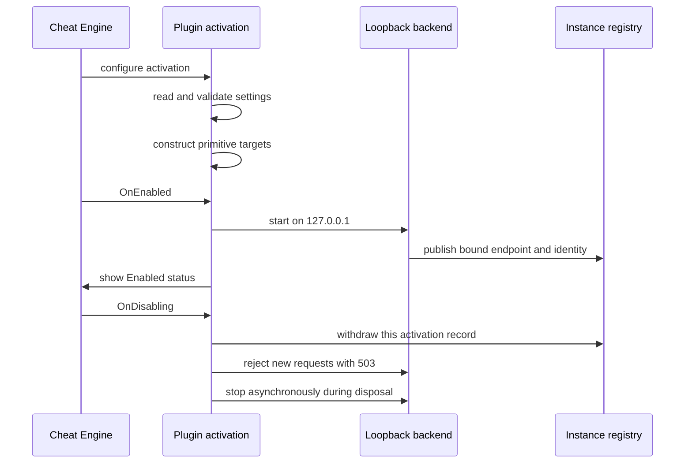

# CheatEngine.Mcp.Plugin

`CheatEngine.Mcp.Plugin` is the Cheat Engine-facing composition root for the
CheatEngine.Mcp server. Cheat Engine loads this project as a managed plugin;
each enabled plugin activation creates one authenticated loopback MCP backend
and publishes that backend for the local gateway.

The project deliberately contains the small amount of code that must know
about Cheat Engine plugin hosting and the SDK. Tool behavior belongs in
[`../CheatEngine.Mcp.Tools`](../CheatEngine.Mcp.Tools/README.md), transport and
instance routing belong in
[`../CheatEngine.Mcp.Hosting`](../CheatEngine.Mcp.Hosting/README.md), and the
complete product setup is documented in the
[repository README](../../README.md).

## Responsibilities

The plugin owns the following integration boundaries:

- The SDK-generated `CheatEngineMcpPlugin` entry point that Cheat Engine
  loads.
- One activation's configuration, logging, Client capability opt-ins, runtime
  identity, and backend services.
- The `McpServerModule` lifecycle adapter that starts and withdraws a backend
  as Cheat Engine enables and disables the plugin.
- The status item shown in Cheat Engine's UI.
- The fixed Lua bridge used by Core to execute implementation-owned Lua on
  Cheat Engine's protected Lua state.

It composes the product primitives with:

```csharp
builder.AddCheatEngineMcp(...)
       .AddTools()
       .AddResources()
       .AddPrompts();
```

The gateway uses the same primitive chain in catalog mode. This keeps the
schemas it advertises aligned with the tools, resources, and prompts served by
an active Cheat Engine instance.

## Project dependencies and build profile

The project targets `net10.0` for Windows x64 and is a framework-dependent
Cheat Engine plugin. It is not published as Native AOT.

Direct package references are:

- `CheatEngine.Client`, which supplies the plugin-hosting activation model and
  the supported Cheat Engine API surface.
- `CheatEngine.SDK`, which generates the plugin entry point and deploys the
  native Lua bridge.
- `ModelContextProtocol.AspNetCore`, which supplies the backend transport.
- `Costura.Fody` and `Fody`, build-time weaving packages that embed managed
  dependencies and the SDK's native Lua bridge in `CheatEngine.Mcp.dll`.
- `Microsoft.AspNetCore.App`, through a framework reference for the loopback
  HTTP host.

It references every product library because it is the final composition root:
Core, Hosting, Tools, Resources, and Prompts. Package versions are centralized
in [`../../Directory.Packages.props`](../../Directory.Packages.props), and
locked restores use this project's `packages.lock.json`.

The shared build settings enable nullable references, analyzers, deterministic
builds, locked package restore, embedded symbols, and x64 output. The project
allows unsafe code because the SDK bridge requires it. ASP.NET Core shared
framework references are exempted from reference AOT and trim compatibility
checks because they do not publish the metadata those checks require; the
plugin's own code remains analyzed.

`eng/Publish.ps1` uses standard framework-dependent `dotnet publish` and installs
only the woven DLL. The SDK continues to generate `CESDK.CESDK`; there is no
separate bootstrap assembly or ZIP payload. Costura extracts and preloads the
native bridge in its temporary cache. `McpPluginDependencyResolver` loads the
managed Costura resources in CE's actual assembly context, preserving each
plugin's SDK state while sharing the installed .NET frameworks.

## Activation lifecycle

Cheat Engine constructs the plugin once and may enable it more than once during
that process lifetime. The plugin's log sink therefore belongs to the plugin
instance, while service registrations and primitive targets belong to a single
activation.



`McpServerModule` may be enabled once. During `OnEnabled`, it creates the
backend, waits until the listener has bound an endpoint, then reports that
endpoint in the status item. A startup failure withdraws and stops any partially
created backend before the enable failure is returned to Cheat Engine.

`OnDisabling` immediately withdraws this activation's discovery record and
asks the backend to reject new requests. It does not wait for HTTP workers on
Cheat Engine's main thread. Client Hosting drains activation-owned leases, then
`Dispose` initiates the bounded backend shutdown in the background. Repeated
shutdown calls share the backend's shutdown task.

Each activation receives its own generated ID and bearer token. After the
listener binds, the backend publishes a descriptor containing its loopback
endpoint to the instance registry. The gateway validates the descriptor and
identity before routing a request. Disabling one Cheat Engine instance removes
only that instance's record.

Primitive containers are resolved before `OnEnabled`. Constructors must only
capture dependencies and validate local state: they must not call
`ICheatEngineClient`, attach to a process, start a scan, or alter Cheat Engine
state. This makes activation failures deterministic and keeps startup inert.

## Configuration owned by the plugin

Settings are read once per activation; none of the sources reload. Disable and
enable the plugin after changing a setting. Sources are applied in this order,
where later values win:

1. Optional `appsettings.json` beside the loaded plugin assembly. Defaults are
   built into the options classes; no settings file ships with the plugin.
2. `%APPDATA%\CheatEngine.Mcp\appsettings.json`, or
   `<MCP_DATA_DIRECTORY>\appsettings.json` when `MCP_DATA_DIRECTORY` names an
   absolute directory.
3. The documented `MCP_*` variables below.

`MCP_DATA_DIRECTORY` selects the user data directory; it is not a normal
configuration key. It must be an absolute path. The default directory also
holds logs. It is intentionally excluded from paths tools may read or write.

| Variable | Maps to | Requirement |
| --- | --- | --- |
| `MCP_HOST` | `Mcp:Host` | Must be exactly `127.0.0.1`. |
| `MCP_PORT` | `Mcp:Port` | Integer from `0` through `65535`; `0` selects a free port. |
| `MCP_INSTANCE_NAME` | `Mcp:InstanceName` | Non-empty, at most 128 characters. Names may repeat. |
| `MCP_INSTANCE_DIRECTORY` | `Mcp:InstanceDirectory` | Absolute registry directory shared with the gateway. |

The bundled defaults bind to `127.0.0.1`, select an automatic port (`0`), and
name the server `CheatEngine.Mcp`. The default registry is
`%LOCALAPPDATA%\CheatEngine.Mcp\instances`. Invalid listener, registry, log,
file-policy, or execution settings fail activation before the backend starts.

The settings that plugin maintainers most often need to recognize are shown
below. This is an override file, so it only needs the values being changed.

```json
{
  "Mcp": {
    "InstanceName": "Training target",
    "Logging": {
      "MinimumLevel": "Information"
    },
    "Files": {
      "AllowedRoots": ["D:\\CheatEngine-Mcp-Output"]
    },
    "Execution": {
      "MaxConcurrentDispatches": 4
    }
  },
  "CheatEngineClient": {
    "AllowedTableRoots": ["D:\\CheatTables"]
  }
}
```

`Mcp:Files:AllowedRoots` permits tool-created output only below explicit
absolute local directories. An empty list, the default, refuses all writes.
The data and instance directories remain protected even if a broad root would
otherwise include them. Cheat-table loading and saving are governed separately
by `CheatEngineClient:AllowedTableRoots`.

`Mcp:Execution` sets activation limits for dispatches and retained jobs. Its
defaults are a 100 ms dispatch budget, four concurrent dispatches, 16 jobs, a
120 second default job lifetime, a 300 second maximum job lifetime, and a
4,096-item job buffer. A dispatch that exceeds its budget is reported; it is
not forcibly interrupted.

The feature switches under `Mcp` default to `true` and are bound into the same
options instance that drives the Client opt-ins:

- `EnableUnsafeLua` exposes caller-authored Lua and table operations that need
  the unsafe Lua capability.
- `EnableAutoAssembler` exposes caller-authored Auto Assembler patches.
- `EnableTargetCodeExecution` controls target and local code execution,
  injection, Mono actions that inject the collector, and speedhack actions.
- `EnableKernelAccess` controls DBK, DBVM, physical-memory, and kernel tools.

These switches remove gated calls before argument binding or Cheat Engine work.
They are exposure controls, not an operating-system sandbox. In particular,
unsafe Lua has Cheat Engine's process privileges.

## Logging and status reporting

The plugin writes one process-specific log to:

```text
<data directory>\CheatEngine.Mcp.<Cheat Engine PID>.log
```

The file writer is shared by references across consecutive activations. A
backend still finishing shutdown retains its reference; the final release lets
the writer drain and close without blocking the Cheat Engine UI thread. The
writer rolls at 10 MiB, retains five archives, bounds its queue to 8,192
entries, and truncates one entry at 32 KiB.

Set `Mcp:Logging:MinimumLevel` to `Trace`, `Debug`, `Information`, `Warning`,
`Error`, `Critical`, or `None`; the default is `Information`. `Trace` can
include tool arguments and results, so use it only while investigating a local
issue and handle the resulting file accordingly. Transport and protocol
categories keep an information floor to avoid leaking the instance bearer
token.

`McpStatusIndicator` displays `Starting`, `Enabled`, `Disabled`, or `Start
failed` in Cheat Engine's menu. UI reporting is best effort: a status update
failure is logged and never changes the lifecycle result.

## Fixed Lua boundary

Most tool operations use the Core dispatch abstraction and fixed,
implementation-owned Lua scripts. `PluginFixedLuaExecutor` is registered here
because only the SDK integration can access Cheat Engine's protected Lua state.
It serializes input as data, executes it through the Client activation boundary,
and uses `PluginLuaJsonWriter` to return bounded structured JSON.

The writer limits copied results to depth 16 and 8 MiB. Keep all direct SDK Lua
state access in this project. Tools must use the Core abstractions and fixed
script helpers so the gateway catalog remains host-independent.

## Development and verification

Build the project from the repository root after restoring the locked solution:

```powershell
dotnet build srcs/CheatEngine.Mcp.Plugin/CheatEngine.Mcp.Plugin.csproj --no-restore
```

Plugin-specific portable coverage is in:

- [`../../tests/CheatEngine.Mcp.Tests/Plugin/McpModuleLifecycleTests.cs`](../../tests/CheatEngine.Mcp.Tests/Plugin/McpModuleLifecycleTests.cs)
  for one-time startup, independent instance withdrawal, failure cleanup, and
  non-blocking shutdown.
- [`../../tests/CheatEngine.Mcp.Tests/Plugin/McpConfigurationTests.cs`](../../tests/CheatEngine.Mcp.Tests/Plugin/McpConfigurationTests.cs)
  for source precedence, environment variables, defaults, and option bounds.
- [`../../tests/CheatEngine.Mcp.Tests/Plugin/FileOptionsTests.cs`](../../tests/CheatEngine.Mcp.Tests/Plugin/FileOptionsTests.cs)
  for the output-path policy and protected internal directories.

Run that area with:

```powershell
dotnet test --project tests/CheatEngine.Mcp.Tests --no-restore --filter-class "CheatEngine.Mcp.Tests.Plugin.*"
```

Those tests use Client doubles and loopback hosts. They validate the managed
plugin composition but do not replace the opt-in live qualification against a
real Cheat Engine installation described in the
[repository README](../../README.md#verification).

For deployment contents, runtime prerequisites, installation, and update
instructions, see [`Distribution/README.md`](Distribution/README.md). The
installed plugin is the single `CheatEngine.Mcp.dll`; the gateway remains a
separate executable. The cold-load probe installs only that DLL and checks
managed context isolation, shared framework identity, the generated ABI, and
native bridge resolution. CE's own `ce.runtimeconfig.json` still selects the
required .NET 10 frameworks.
